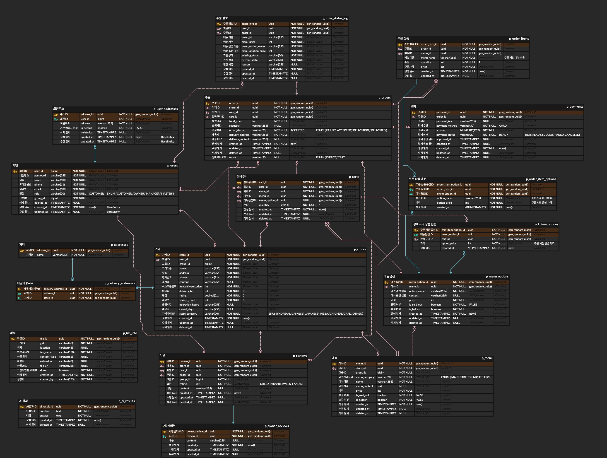
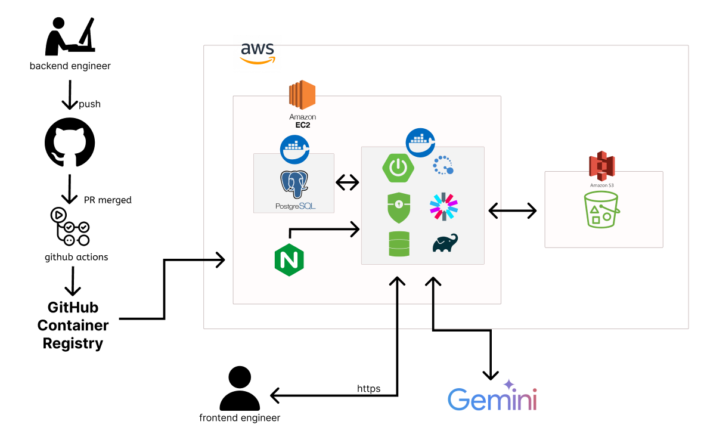

# The-people-of-Gwanghwamun

## Project Objective
> 광화문 지역 기반 배달 주문 관리 플랫폼을 개발하여, 주문 접수와 처리 과정을 자동화하고,
> 스프링 부트 기반 모놀리식 아키텍처 개발 경험과 직관적인 API 문서를 제공하는 것을 목표로 합니다.

## Contributors
<!-- ALL-CONTRIBUTORS-LIST:START - Do not remove or modify this section -->
<!-- prettier-ignore-start -->
<!-- markdownlint-disable -->
<table>
  <tbody>
    <tr>
      <td align="center" valign="top" width="16%">
        <a href="https://github.com/taeaeaeae">
          <br />
          <b>이태경</b>
        </a><br />
        <sub>팀장 / 주문,<br>장바구니</sub>
      </td>
      <td align="center" valign="top" width="16%">
        <a href="https://github.com/Daae-Kim">
          <br />
          <b>김다애</b>
        </a><br />
        <sub>리뷰, 결제</sub>
      </td>
      <td align="center" valign="top" width="16%">
        <a href="https://github.com/minju26">
          <br />
          <b>김민주</b>
        </a><br />
        <sub>회원, 인증/인가</sub>
      </td>
      <td align="center" valign="top" width="16%">
        <a href="https://github.com/S2hyeyunS2">
          <br />
          <b>김혜윤</b>
        </a><br />
        <sub>메뉴, 옵션</sub>
      </td>
      <td align="center" valign="top" width="16%">
        <a href="https://github.com/seolbin01">
          <br />
          <b>박설빈</b>
        </a><br />
        <sub>파일, AI</sub>
      </td>
      <td align="center" valign="top" width="16%">
        <a href="https://github.com/cicle00">
          <br />
          <b>한성연</b>
        </a><br />
        <sub>가게, 배달 지역</sub>
      </td>
    </tr>
  </tbody>
</table>
<!-- markdownlint-restore -->
<!-- prettier-ignore-end -->
<!-- ALL-CONTRIBUTORS-LIST:END -->

## Deploy Link
> Backend | _[https://the-people-of-gwangh.kro.kr](https://the-people-of-gwangh.kro.kr/)_
>
> API Specs | _[Swagger](https://the-people-of-gwangh.kro.kr/)_
>

## Project Architecture
### Tech Stack

#### Backend


#### Infrastructure / DevOps


#### AI / External API Integration


### ERD


### System Architecture


### Directory Structure
```text
src
└─main
  └─java
    └─com.caffeine.gwanghwamun
      ├─common
      │  ├─aws.s3
      │  ├─config
      │  ├─exception
      │  ├─jwt
      │  ├─redis
      │  ├─response
      │  ├─security
      │  └─success
      ├─domain
      │  ├─address
      │  │  ├─controller
      │  │  ├─dto
      │  │  │  ├─request
      │  │  │  └─response
      │  │  ├─entity
      │  │  ├─repository
      │  │  └─service
      │  ├─ai
      │  ├─cart
      │  ├─file
      │  ├─menu
      │  ├─order
      │  ├─payment
      │  ├─region
      │  ├─review
      │  ├─store
      │  └─user
      ├─BaseEntity.java
      └─GwanghwamunApplication.java
```

## Service Setup & Execution
### Development Environment
- Java 17
- Spring Boot 3.x

###  Execution
**1. Project Clone**
```bash
git clone https://github.com/your-org/gwanghwamun.git
cd gwanghwamun
```
**2. Environment Setup**
```bash
# 루트 디렉토리에 .env.dev 파일 생성
```
**3. Gradle Build**
```bash
./gradlew clean build
```
**4. Run Application**
```
./gradlew bootRun
```
